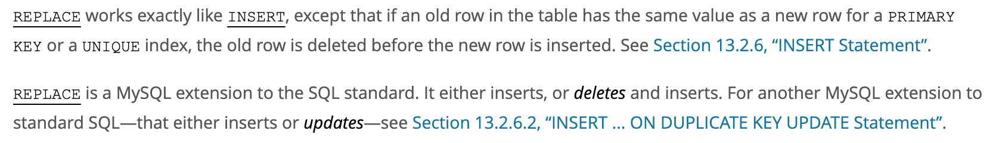

**Note:** If you are enrolled in the course, please access the homework through Gradescope. This copy is intended for auditors.

### Basic SQL Queries

For each problem, write the SQL command that would return the requested rows and columns (don't forget to include the ending semicolon!)

Notes:

1. Be sure to insert spaces before and after keywords unless it is the beginning of the query, as well as between comma separated values
2. Make sure to put a space before and after comparison and arithmetic operators
3. Make sure to use double quotes for anything within VALUES() and for any string comparisons

Return all rows and columns from the items table.

Return the firstName column of all rows in the users table in alphabetical order. Note: You don't have to use ASC in this question.

Return all the information of users in the users table whose lastName is Denero.

Return the second set of 25 rows in the posts table where uuid is not equal to "eeeeee-ffdf-edffesf". Notes: Do not use "!=" for your comparison, and use the shorthand limit notation covered in lecture.

### Modifying tables with SQL

Update the firstName (to "Shane"), lastName (to "Rigan"), and email (to "ryan@calcloud.org") for a user in the users table with uuid = "eeeeee-ffdf-edffesf", or create the row if it does not exist.

Note: Use the syntax used in the lecture slides.

Hint: 
