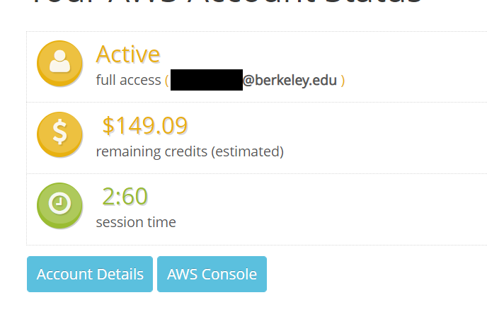

This document will walk you through the process of setting up an Amazon EC2 instance and uploading your BearChat project without any previous configuration. This guide will only be concerned with setting up

### Setting up your EC2 instance

If you already have an EC2 instance set up, you may partially or completely skip this section.

1. Log into AWS using this link: https://www.awseducate.com/signin/SiteLogin


2. Click on "AWS Account" in the upper right. Click on the orange button:


3. You will now be at the AWS Educate landing page. Click on "AWS Console":



4. Search "EC2" in the search bar and click on the "EC2" option in the dropdown. This should take you to the EC2 dashboard.


5. "Instances (running)" to view your instances. Then, click on the "Launch instances" to launch a new EC2 instance. 


6. Select Amazon Linux, then click next.


7. For instance family, choose the following option. Then click next.


8. Accept all default options until you reach "Configure security group." For testing purposes, allow all traffic like so:


9. Accept the remaining default options and create your instance. Upon creation, you will be prompted to download and save a `.pem` file. This holds the credentials needed to connect to your EC2 instance. You can name it anything you want; we name it `api-key.pem`. Keep this in a safe place.


10. Click on "View instances" to return to the EC2 instances panel.


### SSHing into your EC2 instance

If you click on the instance you just created, and then "connect," you will find instructions concerning connecting to your EC2 instance via SSH.


The instructions look like this:


Please follow those instructions to connect to your instance.

If you are still experiencing difficulty, or if you wish to connect via some method other than an SSH client, you may follow the guide from the AWS docs: https://docs.aws.amazon.com/AWSEC2/latest/UserGuide/AccessingInstances.html

If you having trouble connecting, make sure you are using the correct private key and logging in as the user `ec2-user` instead of `root`. If you are using PuTTY (Windows only), make sure you convert your `.pem` file to a `.ppk` file.

### Installing Docker, docker-compose, and git

Amazon Linux uses `yum`. Instructions are adapted from [here](https://docs.aws.amazon.com/AmazonECS/latest/developerguide/docker-basics.html). Run the following commands to install Docker:

```
sudo yum update -y
sudo amazon-linux-extras install docker
sudo service docker start
```

Then relog (log out and log in), and verify that Docker is running by using the following command:

```
docker info
```

In order to install docker-compose:

```
sudo curl -L https://github.com/docker/compose/releases/latest/download/docker-compose-$(uname -s)-$(uname -m) -o /usr/local/bin/docker-compose
sudo chmod +x /usr/local/bin/docker-compose
```

Verify success with:

```
docker-compose version
```

In order to install git:

```
sudo yum install -y git
```

### Setting up BearChat

Run `git clone` with your BearChat Github repository in a directory of your choosing.

Due to `.gitignore`, some files (such as `.env` files) will not be uploaded. The two files you need to upload are:

```
auth_service/.env
db-server/database.env
```

There are a few methods you can use to upload these files to your EC2 instance. The first is to use `scp` in order to copy those files to your EC2 instance. Basic usage is:

```
scp local_file_name username@to_host:/remote/directory/
```

Because you only need to copy a small number of files, you may find it more convinient to manually create a copy of these files on the EC2 instance instead:

```
echo "text here" > filename
```

where `text here` is the contents of the `.env` file and `filename` is the name of that file.

### Running BearChat

Go into your BearChat directory and run:

```
./build.sh
```

You can now make requests to your BearChat service. You can test this by first finding your IPv4 address:


Then try making a request to your service. You can use either your public IPv4 address or your public IPv4 DNS.


