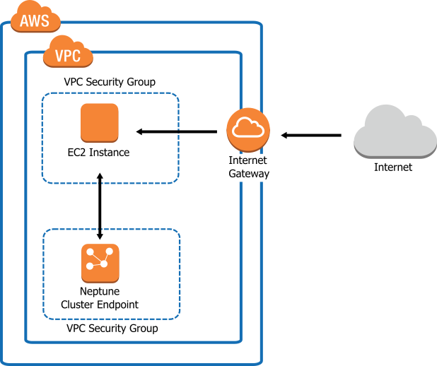
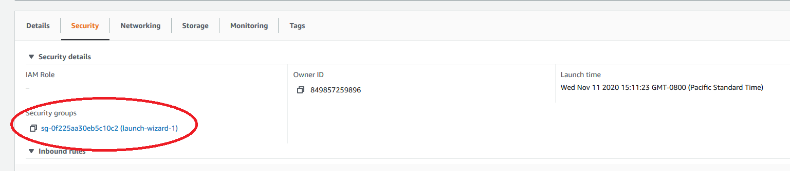
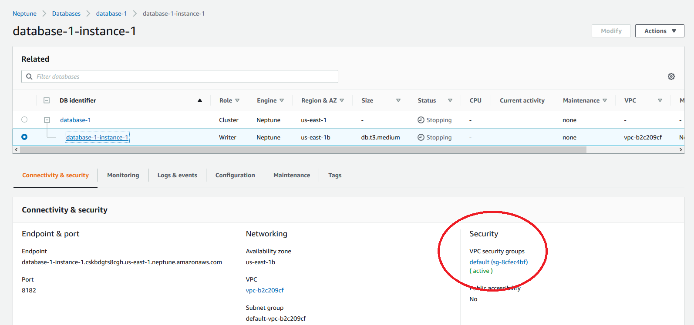
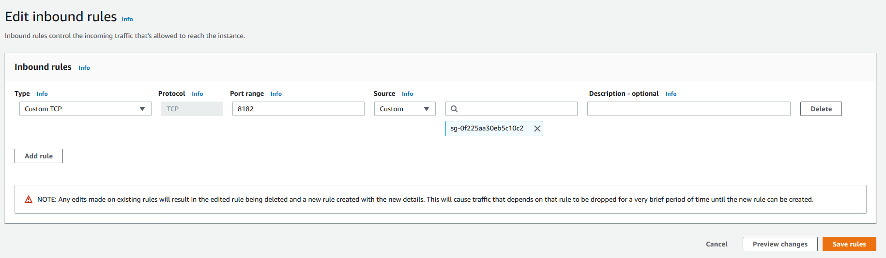

This document will walk you through the process of setting up an Amazon Neptune database without any previous configuration. This guide will only be concerned with setting up Neptune.

Note that it is *not possible* to connect to an Amazon Neptune database directly from your local machine. Instead, you must configure an EC2 instance to act as a bastion server:



Diagram taken from [here](https://docs.aws.amazon.com/neptune/latest/userguide/security-vpc.html).

Fortunately, we will also be hosting our project on our EC2 instance. This simplifies our setup greatly.

Sign into AWS here: https://www.awseducate.com/signin/SiteLogin

### Setting up your EC2 instance

Please consult the "Setting up your EC2 instance" section of [Uploading BearChat to Amazon EC2](/notes/amazon-ec2). If you already have an EC2 instance set up, you may partially or completely skip this section.

### Setting up your Neptune database

1. Go to the AWS console.

2. Search "Neptune" in the search bar and click on the "Neptune" option in the dropdown. This should take you to Neptune's dashboard.

3. Click on "Create database." In the "Connectivity" section, ensure that the "Virtual Private Cloud (VPC)" option matches to your instance's **VPC ID**. Every other option can be kept default. You may choose a production database or a development database at your discretion. We recommend you use a development database first and set up a production database later.

4. Create the database.

5. After you create your database, go back to the Neptune dashboard and click on your newly created database cluster. Take note of the **cluster endpoint** (this should be a URL) and **Port** (default 8182).

### SSHing into your EC2 instance

Please consult the "SSHing into your EC2 instance" section of [Uploading BearChat to Amazon EC2](/notes/amazon-ec2).

You may also follow the guide from the AWS docs: https://docs.aws.amazon.com/AWSEC2/latest/UserGuide/AccessingInstances.html

If you having trouble connecting, make sure you are using the correct private key and logging in as the user `ec2-user` instead of `root`. If you are using PuTTY (Windows only), make sure you convert your `.pem` file to a `.ppk` file.

### Connecting to your Neptune database 

1. SSH into your EC2 instance.

2. Follow the instructions in the AWS docs here: https://docs.aws.amazon.com/neptune/latest/userguide/access-graph-gremlin-console.html

   - You may run into an issue when you try running the command `cp {@jre_path}/lib/security/cacerts /tmp/certs/cacerts`. If you are using a freshly provisioned EC2 instance, you can ignore this step.

   - When you see `your-neptune-endpoint`, use your **cluster endpoint**.
   
   - If you are experiencing "Host did not respond in a timely fashion," please see the section "Configuring Security Group" below.
   
3. The AWS docs provide the example query `g.V().limit(1)` in order to test your connection to the Neptune database. If you'd like, you can copy paste the following commands to populate your database with test data:

```
g.addV().property("uuid", 123456)
g.addV().property("uuid", 654321)
g.V().has("uuid", 123456).bothE("friends with").where(otherV().has("uuid", 654321)).count()
g.addE("friends with").from(g.V().has("uuid", 123456)).to(g.V().has("uuid", 654321))
g.V().has("uuid", 123456).bothE("friends with").where(otherV().has("uuid", 654321)).count()
g.V().has("uuid", 654321).bothE("friends with").where(otherV().has("uuid", 123456)).count()
g.V().count()
```

Lines 1-2: add two people with uuid `123456` and `654321`.

Line 3: check if `123456` and `654321` are friends. Returns 1 if they are and 0 if they are not. Should return 0.

Line 4: adds an edge between `123456` and `654321` to indicate that they are friends.

Lines 5-6: check if `123456` and `654321` are friends. Returns 1 if they are and 0 if they are not. Both should return 1.

Line 7: check how many people are in our database. Should be 2.

You can then delete the test data by entering:

```
g.V().drop()
```

Exit the gremlin console by entering `:exit`

You may also make a HTTPS request to the Neptune database:
```
curl -X POST -d '{"gremlin":"<GREMLIN_QUERY_HERE>"}' https://NEPTUNE_CLUSTER_ENDPOINT:PORT/gremlin
```

You must call the HTTPS response through EC2. The HTTPS request will always fail if you execute it on your local machine.

### Configuring Security Group

If the Neptune request is failing, your EC2 instance and Neptune database may be configured such that Neptune blocks connections from EC2. To fix this, perform the following steps:

1. Go to your EC2 instance and take note of your EC2 security group:



2. Go to your database instance and click on the security group:



3. For your Neptune security group, add the following inbound rule:

```
Custom TCP - Port range 8182 - Custom source - <your EC2 security group>
```


