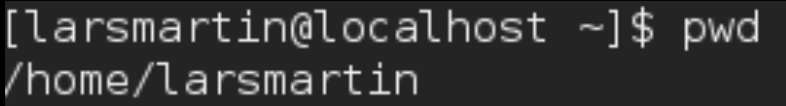
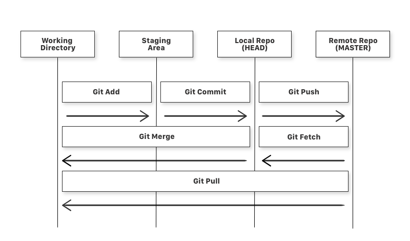
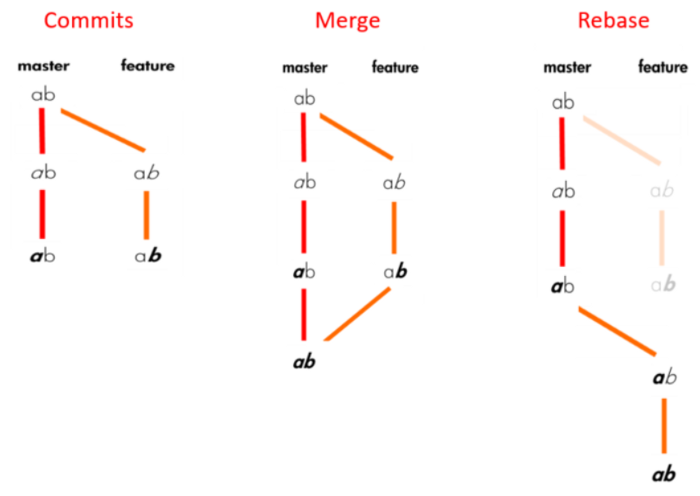
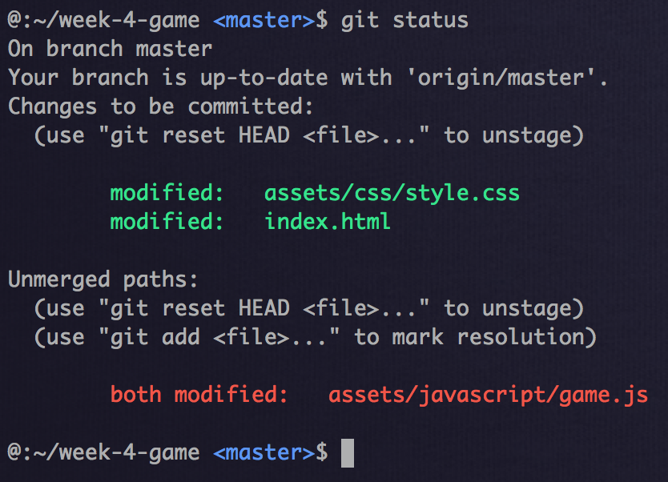
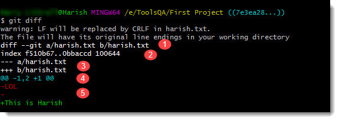
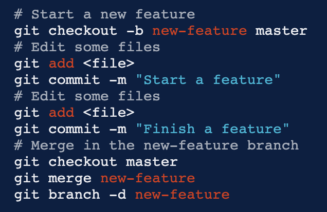

### Terminal Navigation

`pwd`: present working directory



`ls`: shows the contents in your current directory
 - `-a`
 - `-l`: lists directory's contents in an ordered list
 - `*.<fileExtension>`: lists the file in question

`cd`
 - `<folderName>` : enters that directory
 - `..`: returns to directory a level above
 - `../..`: returns to directory two levels above

`man`
 - `<command>`: displays user manual of command

### File Manipulation

`cat`
 - `<fileName>`: will display file contents in terminal (can show multiple files if you list filenames spaced apart)

`head`
 - `-n <numberOfLines> <fileName>`: will display the first provided number of lines of the file; default returns first 10

`tail`
 - `-n <numberOfLines> <fileName>`: will display the last provided number of lines of the file; default returns last 10

`mkdir`
 - `<folderName>`: creates a folder in your current directory
 - `<folder1>/<folder2>`: creates folder in folder 2 using the path provided

`touch`
 - `<fileName>`: create new blank file in this directory

`cp`
 - `<fileName> <newFileName>`: copies `fileName` and renames it to `newFileName`
 - `<fileName> <folderName>`: copies `fileName` to specified `folderName`
 - `-R <folderName> <newFolderName>`: copies `folderName` and renames it to `newFolderName`
 - `*.<fileExtension> <folderName>`: copies all files ending in `fileExtension` to `folderName`

`mv`
 - `<fileName> <folderName>`: moves file to folder
 - `<folderName> <folderName2>`: moves folder1 into folder2
 - `<fileName> <newFileName>`: renames file
 - `<folderName> <newFolderName>`: renames folder
 - `<folderName>/..`: moves folder to the directory one level higher than this one

`rm`
 - `<fileName>`: deletes this file
 - `-r <folderName>`: deletes this folder

### Extract Data

`grep`
 - `<someText> <fileName>`: get lines that have `someText`
 - `-r <someText> <folderName>`: all files that have `someText`

### Git





### Initializing a Repo

1. Locally create a directory for your project. To do this through terminal, you can:
  1. `cd <path/To/TheDirectoryYouWantYourFolderToBeIn>`
  2. `mkdir <newFolderName>`
  3. Then confirm that the new directory is made correctly using `ls`
2. `cd <folderName>` to go into that folder
3. Before typing `git init` make sure you have configurated your github info. See config instructions below.
  - If you get this error on a Mac: 
  ```xcrun: error: invalid active developer path (/Library/Developer/CommandLineTools), missing xcrun at: /Library/Developer/CommandLineTools/usr/bin/xcrun```
  Your Xcode Command-line Tools need to be updated. So enter into terminal `xcode-select --install`

### Status

`git status` will show you what files have been modified but not committed among other changes.



### Tracked vs untracked files

staging area, why do we add before committing
 
 - `git add .` adds modified file to the staging area form where things are committed
 - `commit` records and saves the changes for the files you added
 - `push` officially shares your changes to your git branch
 - `git diff`



1. The first line shows the file names that have been considered as the input in git diff. You can see that they have been marked by a and b along with the two different file state that has been taken as input.
2. This line is not of use. This shows the metadata related to the command and the execution of it on the files. As you must be aware by our discussion in Dot Git folder, this is the object hash value required by Git for internal use.
3. This line defines the symbol, called a legend, to tell you what is used to describe the first file and what is used to describe the second file. As you can see, – is used in front of the first file and + is used in front of the second file. So whenever diff shows you the changes related to the first file, they will be marked by – and the changes in the second file will be marked by the symbol +.
4. The fourth line shows you symbol @@ and symbols ahead of it. They are called chunks. Chunks in git diff define the change’ summary. In our image below the following chunk can be seen @@ -1,2 +1 @@
5. This means that line one and two were changed in the first file and line one was changed in the second file. Remember the – and + symbol used in the third point to as a symbol to the first and second file respectively.

### Branching

 - `git branch` shows the name of the branch you are in
 - `git checkout -b <nameOfBranch>` creates a branch with given name; all of your changes will only affect this branch

### Merging Branches and Rebasing

`git merge` adds the changes from your branch to another branch that you want (e.g. below we switch to the master branch with the checkout command then merge the new feature



If there is a merge conflict (usually from uncommitted things), manually fix the highlighted changes that pop up in your editor. You will have a choice of whether to accept your branch’s change or the other branch’s version

### Pull Requests

Get files from a certain branch: 

```
git pull <branchname>
git pull origin master
git pull origin <yourBranchName>
```

### Configuring Git

```
git config --global user.name "YOUR_USERNAME"
git config --global user.email "EMAIL@DOMAIN.COM"
git config --global --list # To check the info you just provided saved properly
```
