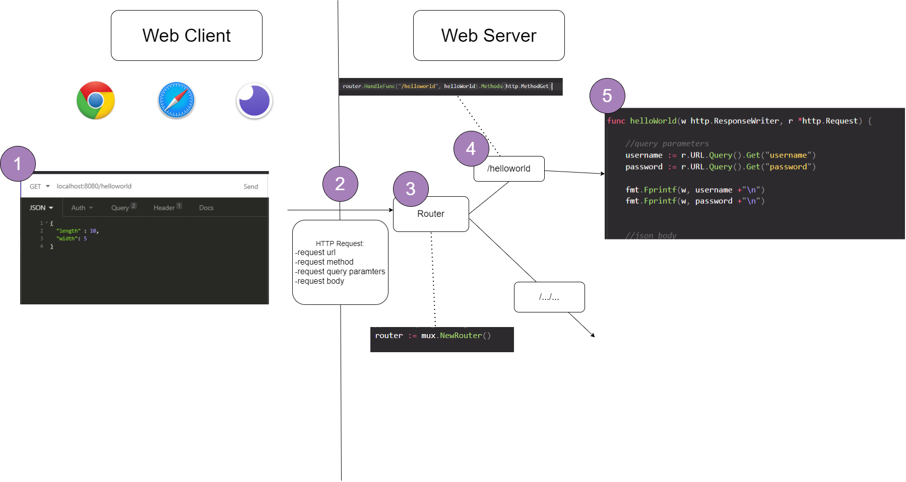

During lecture on September 17, we built a simple HTTP server in Golang. We could run the server locally, and it accepted and received HTTP requests.

https://github.com/BearCloud/Lecture_091720_demo

Below is a diagram outlining the path a HTTP request takes through our server.

1. A web client has data it wants to send. The client can be a browser (Chrome, Safari, Firefox) or a REST client (Insomnia, Postman, curl).

2. The client packages the data into a request. The request contains a method, URL, query parameters, and body.

3. Our server receives the HTTP request at the router.

4. The router chooses the relevant method to direct the HTTP request to.

5. Our method contains logic which processes the data and returns an appropriate response.
